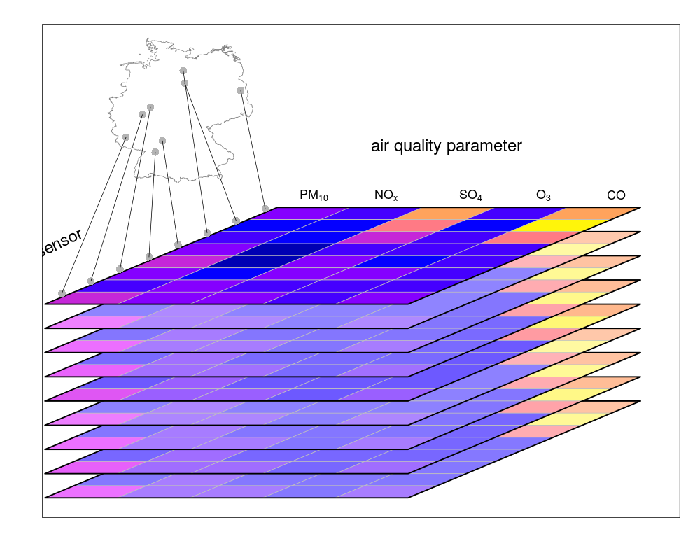

```{r setup, include=FALSE}
knitr::opts_chunk$set(echo = FALSE)
library(sf)
library(tidyverse)
nc = read_sf(system.file("gpkg/nc.gpkg", package="sf"))
pts = st_centroid(st_geometry(nc))
xy = st_coordinates(st_centroid(nc$geom))
```

## Data science: the table view

```{r, results='asis'}
cols = c(3,5,9:14)
knitr::kable(as.data.frame(nc)[1:7,cols])
```

## ... with coordinates
```{r, results='asis'}
cols = c(3,5,9:10,16:17)
# xy = st_coordinates((nc$geom))
nc$longitude = xy[,1]
nc$latitude = xy[,2]
knitr::kable(as.data.frame(nc)[1:7,cols])
```

## ... with POINT geometries
```{r, results='asis'}
cols = c(3,5,9:14)
nc$geometry = format(pts)
cols = c(3,5,9:10,ncol(nc))
knitr::kable(as.data.frame(nc)[1:7,cols])
```

## ... with POLYGON geometries
```{r, results='asis'}
cols = c(3,5,9:14)
nc$geometry = format(nc$geom, width = 50)
cols = c(3,5,9:10,ncol(nc))
knitr::kable(as.data.frame(nc)[1:7,cols])
```


## the "shapefile" view

```{r}
plot(nc[c("SID74", "SID79")], key.pos = 4)
st_crs(nc)
```

## Coordinate reference systems

* are the "measurement units" of spatial coordinates
* relate a location to a particular reference ellipsoid ("datum") 
* may describe a 2-D projection

```{r fig.height=4}
plot(nc[c("SID74")], key.pos = 4, axes = TRUE, graticule = TRUE)
knitr::include_graphics('xkcd.png')
```
                                                                    https://xkcd.com/977/

##

```{r, echo=TRUE}
pts = st_centroid(st_geometry(nc))
st_crs(pts)
pts[[1]]
st_transform(pts[1], "+proj=longlat +datum=WGS84")[[1]]
```

## Joining tables, spatially

* if `longitude` and `latitude` are in columns (fields), then regular `join` will work
* if you have `POINT` geometries in a column, use `st_equals` (or `st_within_distance`)
* if you have other geometries, there are a lot of options: 
    * `st_intersects`, `st_disjoint`
	* `st_covers`, `st_covered_by`, `st_touches`, `st_within`
	* ...
	* `st_relate` with pattern

<!-- illustrate: overlaps, touches, touches-along-line -->
```{r,fig.height=3,fig.width=11}
par(mfrow = c(1, 3))
suppressMessages(f0 <- f <- st_filter(nc, nc[10,], .predicate = st_intersects))
plot(st_geometry(f0), main = "st_intersects")
plot(st_geometry(f0), col = 'green', add = TRUE)
plot(st_geometry(nc[10,]), col = NA, border = 'red', add = TRUE, lwd = 3)
suppressMessages(f <- st_filter(nc, nc[10,], .predicate = st_touches))
plot(st_geometry(f0), main = "st_touches")
plot(st_geometry(f), col = 'green', add = TRUE)
plot(st_geometry(nc[10,]), col = NA, border = 'red', add = TRUE, lwd = 3)
suppressMessages(sel <- lengths(st_relate(nc, nc[10,], pattern = "F***1****")) > 0)
plot(st_geometry(f0), main = "st_relate: touch along line")
plot(st_geometry(nc)[sel], col = 'green', add = TRUE)
plot(st_geometry(nc[10,]), col = NA, border = 'red', add = TRUE, lwd = 3)
```

## Machine learning with coordinates as features

Potential issues:

* you are trying to explain variability by _where_, instead of (or in addition to, or as an alternative to) _what_ is going on there (feature variables); this may be competitive, but might be so for the wrong reason (extrapolation?)
* in case you have clustered training data and use naive (random) cross validation, location may pretty well point out the cluster, and result in overly optimistic performance 
* as with regression modelling strategies, check that the models are not sensitive to translations and rotations of coordinates (in $R^2$, or $S^2$, or both?)

## GIS and the curse of two-dimensionality

```{r fig.height=3}
library(rnaturalearth)
w = ne_countries(returnclass = "sf")
par(mar=c(3.1,3.1,0.1,0.1))
plot(st_geometry(w), add = FALSE, border = 'orange', axes = TRUE, xlim = c(-180,180))
g = st_make_grid() # global 10-degree grid
plot(g, add = TRUE)
plot(g[c(1,36)], col = c('red', 'green'), add = TRUE)
```
```{r echo=TRUE}
g[c(1,36)] %>% st_touches()
```

----

```{r,fig.height=3}
g = st_make_grid()[1:108]
g1 = st_transform(g, 3031)
par(mar=rep(0,4))
plot(g1)
plot(g1[c(1,36)], col = c('red', 'green'), add = TRUE)
plot(st_transform(w[7,1], 3031), add = TRUE, col = NA, border = 'orange')
```
```{r,echo=TRUE}
g[c(1,36)] %>% st_transform(3031) %>% st_touches()
g[c(1,36)] %>% st_transform(3031) %>% st_set_precision(units::set_units(1, mm)) %>% st_touches()
```

## Now we have three problems:
```{r fig.height=4,fig.width=11}
par(mfrow = c(1,2))
g = st_make_grid()
plot(g, axes = TRUE, main = 'equirectangular')
plot(g[c(1,36)], col = c('red', 'green'), add = TRUE)
plot(g1, main = 'polar stereographic')
plot(g1[c(1,36)], col = c('red', 'green'), add = TRUE)
```

1. are polygons 1 (red) and 36 (green) square, or triangular?
1. do they touch each other, or not?
1. when should we round polygon coordinates?

<!--
```{r}
g[c(1,36)] %>% st_transform(3031) %>% st_set_precision(units::set_units(1, mm)) %>% lwgeom::st_make_valid() #`[[`(1) #st_is_valid()
```
-->

## Is this a real problem?

* treating geodetic coordinates (degrees) as 2-D (GIS) often works fine, in particular for small areas not close to the poles
* if *you* really _assume_ angles are interpreted as equirectangular, all is fine!
* writing software that warns only in case of problems is very hard: when is a an answer wrong enough to trigger an error?
* writing software that emits warnings (like sf) invites downstream developers to silence these warnings...
* PostGIS ("geography", and `sf` through pkg `lwgeom`) currently take a half-hearted approach: 
    * do many things "right" (areas, distances)
    * don't offer, or emulate, complicated things (`st_intersects`, `st_buffer`) or warn;
* modern systems (s2geometry/h3; Google BigQuery GIS, GEE) take an integral global approach, which makes a lot of sense to me
* modellers map the world from 0 to 360 degrees; many plots call for including the antimeridian; many model grids are in long-lat _after rotating poles_

## GeoJSON [rfc9746](https://tools.ietf.org/html/rfc7946)

GeoJSON writes the GIS legacy problem in the standard: lines or polygons _shall never cross_ the antimeridian (180E/-180W):

Clause  3.1.9. Antimeridian Cutting:

*    In representing Features that cross the antimeridian, interoperability is improved by modifying their geometry.  Any geometry that crosses the antimeridian SHOULD be represented by cutting it in two such that neither part's representation crosses the antimeridian.

## What does the polygon mean?

for the polygon
```{r}
g[[1]]
```
the _simple feature access_ (OGC) standard says that we interpret this as points, connected by straight-line interpolation. What do _straight lines_ mean here?

* Equirectangular: follow lines with constant longitude or latitude (think graticule)
* Constant direction (loxodrome): straight line on a Mercator projection
* On the sphere:
   * _real_ straight lines: take you from $S^2$ to $R^3$, meaning go subsurface (and require 3D coordinates)
   * _great circle arcs_ (orthodrome): arc of the circle passing through the two points and the Earth's center
   * such an arc, but on an ellipsoid

-----

```{r fig.height = 3, fig.width=11}
g0 = g[1]
p1 = g0 %>% st_set_crs(NA) %>% st_segmentize(0.5)
p2 = g0 %>% st_segmentize(units::set_units(10, km))
par(mfrow = c(1, 2))
plot(p2, axes = TRUE, ylim = c(-80.4,-80), border = 'green', main = 'equirectilinear')
plot(p1, add = TRUE, border = 'red')
p2 %>% st_transform(3031) %>% plot(axes = TRUE, border = 'green', ylim = c(-1.13e6,-1.05e6), main = 'polar stereographic')
st_crs(p1) = 4326
p1 %>% st_transform(3031) %>% plot(add = TRUE, border = 'red')
```
```{r, echo=TRUE}
st_area(p1) %>% units::set_units(km^2) # segmentized along parallel
st_area(p2) %>% units::set_units(km^2) # segmentized along great circle
```
```{r}
a1 = st_area(p1) %>% units::set_units(km^2) # segmentized along parallel
a2 = st_area(p2) %>% units::set_units(km^2) # segmentized along great circle
d = (a1/a2) %>% units::set_units('%')
d - units::set_units(100, "%")
```

-----


```{r,fig.width=11,fig.height=3.5}
par(mfrow=c(1,2))
par(mar = c(0,0,1,0))
plot(st_geometry(w[7,1]), col = NA, border = 'orange', main = "equirectangular", asp = 2)
plot(st_geometry(st_transform(w[7,1], 3031)), col = NA, border = 'orange', main = "polar stereographic")
```
```{r echo=TRUE}
w[7,] %>% st_geometry() %>% st_is_valid()
w[7,] %>% st_geometry() %>% st_transform(3031) %>% st_is_valid()
```

## Floating point operations

```{r echo=TRUE}
1/3 == (1 - 2/3)
(x = c(1/3, 1 - 2/3))
print(x, digits = 20)
diff(x)
```

## 8-byte doubles for coordinates: what does it mean?

* 1 degree is approximately 110 km:
* 8-byte doubles represent difference in numbers up to roughly 2e-16
```{r,echo=TRUE}
.Machine$double.eps
2.2e-16 * units::set_units(110, km) %>% units::set_units(nm)
```
* unlike integers, floating point numbers are not uniformly distributed
* this leads often to numerical problems (invalid geometries) when doing geometrical operations, e.g. with GEOS
* solution may be to limit precision (round coordinates e.g. to mm), but this is often trial-and-error work

## Spatial data: Support

```{r out.width=600}

```

* land use: point support (n is large)
* population density: polygon support (n is 1)

## Spatial data: raster

```{r fig.width=10,fig.height=2.4}
suppressPackageStartupMessages(library(stars))
system.file("tif/L7_ETMs.tif", package = "stars") %>% read_stars() %>% `[`(,,,1:4) %>% plot()
```

* is "the coordinate of a raster cell" the raster center, or a corner?
* which corners, which sides, belong to a raster cell?
* is a raster cell:
    * a small polygon with constant value
    * a small polygon with an aggregated value
	* the value of the variable at the cell center?

## Spatiotemporal data: 1. irregular

* events: earthquakes, disease cases, births, bird sightings etc.
   * in addition to a geometry, every event has a time stamp (or period)
   * interest is in frequencies, densities, space/time interactions, generating process ...
* movement data: life lines, bus tracks, migration patterns
   * sequences of (locations, times) form a track
   * collections of tracks are often analysed jointly
   * ecology: home range / utility distribution function estimation
   * interest is density, traffic, space/time interactions, generating process, aliby problems, ...

Many operations (aggregation, densities) lead to regular spatiotemporal data structures

## Spatiotemporal data: 2. regular (data cubes)

For every location, the same time sequence is available
    * (static) sensor data: weather or air quality monitoring, streamflow measurement, traffic sensors
	* imagery from fixed cameras (video)
	* satellite imagery
	* weather and climate modelling

One can use tables for this, but it often makes more sense to use
multidimensional _arrays_ for this, which map dimensions to attributes; for this reason these data are called _data cubes_

* AQ: location, time, parameter $\rightarrow$ value (vector data cube)
* satellite: row, col, wavelength (color) $\rightarrow$ value (raster data cube)
* weather model: long, lat, time of forecast, time to forecast, pressure (altitude) $\rightarrow$ temperature, wind, humidity, ...

## raster data cube 1

```{r out.width=1000}
knitr::include_graphics('cube1.png')
```

## raster data cube 1

```{r out.width=1000}
knitr::include_graphics('cube2.png')
```

## vector data cube 1

```{r out.width=800}
knitr::include_graphics('cube3.png')
```

## vector data cube 2

```{r out.width=800}

```

## Using data cubes

A lot of weather, climate model, and satellite imagery is available for free

* ERA5, global reanalysis 1979-2019, .25$^o$ grid, global, 37 pressure levels (9 Pb)
* Climate model intercomparison programs: CMIP4, CMIP5 (6 Pb)
* Satellite imager: NASA, Copernicus data (...)

If a small dataset is needed, it can be downloaded; for larger analysis this quickly becomes impractical.

* on cloud platforms serving the data, going through the files is often still tedious
* a platform that offers high-level and fast (data cube based) access is Google Earth Engine (GEE)
* GEE is, however, closed source and its free tier has usage restrictions
* we ([openEO.org](https://openeo.org)) developed an open API (and several clients) which uses a data cube interface to a variety of cloud platforms (GEE, Geotrellis/GeoPySpark, Grass GIS/actinia, Rasdaman, ...)

## Summarizing

1. spatial data can be seen as 
    * tables, extended with geometries that have a coordinate reference system (DS)
	* geometry sets, with attributes in tables (GIS)
1. for DS, many new operators become available (predicates, measures, intersection/buffer/union)
1. it matters whether you conceive your data as flat, or on a sphere, for instance for what a "straight line" means 
1. the legacy 2D GIS view may have had its days
1. floating point ops often cause trouble in geometrical operations
1. spatial data have a support, which is important for meaningfully analysing them, but often doesn't come with the data
1. spatiotemporal data can be irregular or regular
1. irregular spatiotemporal data is often handled in tables (or nested tables)
1. regular spatiotemporal data lead to vector or raster data cubes
1. there is a wealth of cube data openly available, still challenging to analyse, but with huge potential
